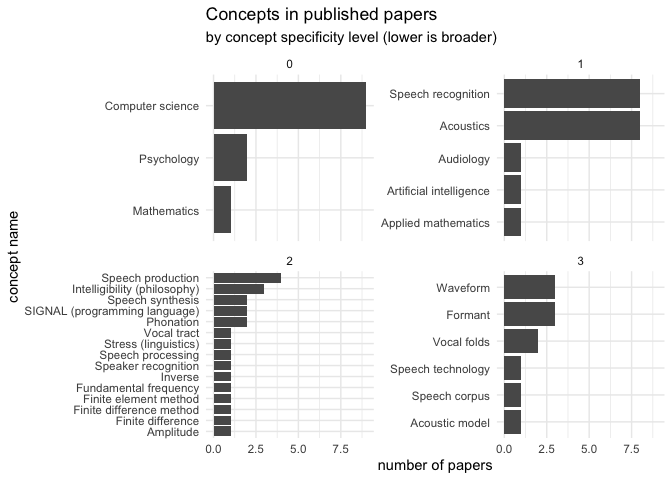
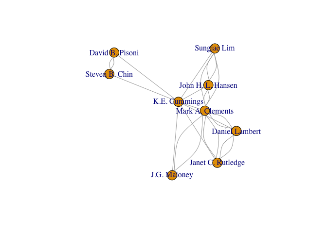

<!-- README.md is generated from README.Rmd. Please edit that file -->

# openalexR

<!-- badges: start -->
<!-- badges: end -->

The goal of openalexR is to create an R wrapper for the Open Alex API
(<https://openalex.org>) which allows users to query and extract results
from the Open Alex database of academic research output. Open Alex
succeeds the Microsoft Academic Graph in maintaining an extensive
relational database. The API has 5 endpoints to query: (1) Works
(journal & conference papers, books, data, etc); (2) Authors; (3)
Venues; (4) Institutions; and (5) Concepts. More information about each
of these endpoints can be found here: (<https://docs.openalex.org>).

The API is completely free, open source, and has no rate limits. If you
prefer, you can also request a snapshot of all of the data to be copied
into an amazon s3 bucket
(<https://docs.openalex.org/download-snapshot>).

openalexR has functions to request data from each of the five endpoints:
get\_works, get\_authors, get\_venues, get\_institutions, and
get\_concepts. It also has some wrapper functions for specific needs
(get\_authors\_papers, get\_coauthors).

## Installation

You can install the development version of openalexR from
[GitHub](https://github.com/) with:

``` r
# install.packages("devtools")
devtools::install_github("ekmaloney/openalexR")
```

## Find Works

The find\_works function takes three main parameters: (1) ID type, one
of: doi, open\_alex, mag (Microsoft Academic Graph), pmid (Pubmed
Identifier), pmcid (Pubmed Central Identifier) (2) Id(s), can either be
1 id or a list of ids. (3) Variable\_unnest (optional) - a variable by
which you would like to make the dataframe longer (can be: authorships,
concepts, referenced\_works, related\_works, and citation\_counts\_year)

For example, if I wanted to look up the paper “Analysis of the glottal
excitation of emotionally styled and stressed speech” by Kathleen E.
Cummings (my mom!) and Mark A. Clements, I can use the doi
(<https://doi.org/10.1121/1.413664>) to do so as shown below:

``` r
library(openalexR)
library(tidyverse)
#> ── Attaching packages ─────────────────────────────────────── tidyverse 1.3.1 ──
#> ✓ ggplot2 3.3.5     ✓ purrr   0.3.4
#> ✓ tibble  3.1.6     ✓ dplyr   1.0.7
#> ✓ tidyr   1.1.4     ✓ stringr 1.4.0
#> ✓ readr   2.1.1     ✓ forcats 0.5.1
#> ── Conflicts ────────────────────────────────────────── tidyverse_conflicts() ──
#> x dplyr::filter() masks stats::filter()
#> x dplyr::lag()    masks stats::lag()

paper_info <- find_work(id_type = "doi", 
                         id = "https://doi.org/10.1121/1.413664",
                         variable_unnest = "authors")

glimpse(paper_info)
#> Rows: 2
#> Columns: 19
#> $ id                   <chr> "https://openalex.org/W2062207950", "https://open…
#> $ title                <chr> "Analysis of the glottal excitation of emotionall…
#> $ publication_date     <chr> "1995-07-01", "1995-07-01"
#> $ openalexid           <chr> "https://openalex.org/W2062207950", "https://open…
#> $ doi                  <chr> "https://doi.org/10.1121/1.413664", "https://doi.…
#> $ pmid                 <chr> "https://pubmed.ncbi.nlm.nih.gov/7608410", "https…
#> $ mag                  <int> 2062207950, 2062207950
#> $ host_venue_info      <list> [<tbl_df[3 x 7]>], [<tbl_df[3 x 7]>]
#> $ works_type           <chr> "journal-article", "journal-article"
#> $ open_access          <lgl> FALSE, FALSE
#> $ open_access_status   <chr> "closed", "closed"
#> $ authors_id           <chr> "https://openalex.org/A2109682146", "https://open…
#> $ authors_name         <chr> "K.E. Cummings", "Mark A. Clements"
#> $ authors_orcid        <lgl> NA, NA
#> $ citation_count       <int> 97, 97
#> $ concepts             <list> [<data.frame[7 x 5]>], [<data.frame[7 x 5]>]
#> $ referenced_works     <list> [], []
#> $ related_works        <list> <"https://openalex.org/W2109138290", "https://ope…
#> $ citation_counts_year <list> [<data.frame[10 x 2]>], [<data.frame[10 x 2]>]
```

This function returns a tibble with some nested columns. I decided to
unnest the authorships column, so I can extract the openalex id for
Kathleen E. Cummings to use to retrieve all of her published work
(get\_authors\_papers) and her coauthorship network (get\_coauthors).

The get\_authors\_papers() function works similarly to find\_work - you
need to indicate what type of id you are supplying and the id itself.
Here I use the openalex id I got from the previous result.

``` r
#get the openalex id
mom_oa_id <- paper_info$authors_id[1]

#get all papers she published 
all_papers <- get_authors_papers(id_type = "openalex",
                                 id = mom_oa_id)


glimpse(all_papers)
#> Rows: 10
#> Columns: 29
#> $ id                    <chr> "https://openalex.org/W2050783745", "https://ope…
#> $ doi                   <chr> "https://doi.org/10.1121/1.415167", "https://doi…
#> $ mag                   <chr> "2050783745", "2062207950", "1590551706", "20587…
#> $ openalex              <chr> "https://openalex.org/W2050783745", "https://ope…
#> $ pmid                  <chr> NA, "https://pubmed.ncbi.nlm.nih.gov/7608410", N…
#> $ title                 <chr> "Analysis of the glottal excitation of intoxicat…
#> $ publication_date      <chr> "1996-04-01", "1995-07-01", "1995-05-09", "1994-…
#> $ relevance_score       <lgl> NA, NA, NA, NA, NA, NA, NA, NA, NA, NA
#> $ host_venue_id         <chr> "https://openalex.org/V11296630", "https://opena…
#> $ host_venue_name       <chr> "Journal of the Acoustical Society of America", …
#> $ host_venue_publisher  <chr> "Acoustical Society of America", "Acoustical Soc…
#> $ host_venue_issn       <list> <"1520-8524", "0001-4966", "1520-9024">, <"1520-…
#> $ host_venue_iss_l      <chr> "0001-4966", "0001-4966", NA, "0001-4966", "000…
#> $ host_venue_type       <chr> "publisher", "publisher", "publisher", "publishe…
#> $ host_venue_url        <chr> "https://doi.org/10.1121/1.415167", "https://doi…
#> $ host_venue_oa         <lgl> FALSE, FALSE, FALSE, FALSE, FALSE, FALSE, FALSE,…
#> $ host_venue_version    <lgl> NA, NA, NA, NA, NA, NA, NA, NA, NA, NA
#> $ host_venue_license    <lgl> NA, NA, NA, NA, NA, NA, NA, NA, NA, NA
#> $ authorships           <list> [<data.frame[3 x 4]>], [<data.frame[2 x 4]>], [<…
#> $ concepts              <list> [<data.frame[8 x 5]>], [<data.frame[7 x 5]>], [<…
#> $ alternate_host_venues <list> [], [], [], [], [], [], [], [], [], []
#> $ cited_by_count        <int> 0, 97, 3, 0, 2, 16, 13, 0, 33, 7
#> $ publication_year      <int> 1996, 1995, 1995, 1994, 1994, 1993, 1992, 1991, …
#> $ cited_by_url          <chr> "https://api.openalex.org/works?filter=cites:W2…
#> $ type                  <chr> "journal-article", "journal-article", "proceedi…
#> $ paratext              <lgl> FALSE, FALSE, FALSE, FALSE, FALSE, FALSE, FALSE…
#> $ retracted             <lgl> FALSE, FALSE, FALSE, FALSE, FALSE, FALSE, FALSE,…
#> $ referenced_works      <list> <>, <>, <"https://openalex.org/W2051535326", "ht…
#> $ related_works         <list> <"https://openalex.org/W1994886694", "https://op…
```

You can explore these results – here I look at the distribution of
concepts across her published work.

``` r
all_papers %>% 
    unnest(concepts, names_sep = "_") %>% 
    group_by(concepts_display_name, concepts_level) %>% 
    summarise(count = n()) %>% 
    ggplot(mapping = aes(x = reorder(concepts_display_name, count), y = count)) + 
    geom_col() + coord_flip() + facet_wrap(~concepts_level, scales = "free_y") +
    theme_minimal() + labs(title = "Concepts in published papers",
                           subtitle = "by concept specificity level (lower is broader)",
                           x = "concept name", y = "number of papers")
#> `summarise()` has grouped output by 'concepts_display_name'. You can override
#> using the `.groups` argument.
```



Finally, you can also use the get\_coauthors() function to collect the
coauthorship network of the specified author of choice.

``` r
kate_direct_coauthors <- get_coauthors(id_type = "openalex",
                                       id = mom_oa_id)
#> Joining, by = "ego_author"

coauthors_tibble <- get_coauthors(id_type = "openalex", 
                                  id = unique(kate_direct_coauthors$alter_author))
#> Joining, by = "ego_author"

only_ego_net <- coauthors_tibble %>% filter(alter_author %in% kate_direct_coauthors$alter_author)

all_connections <- bind_rows(kate_direct_coauthors, only_ego_net) %>% 
                   dplyr::mutate(ego_first = paste(ego_author_name, alter_author_name, sep = "_"),
                          alter_first = paste(alter_author_name, alter_author_name, sep = "_")) %>% 
                   tidyr::pivot_longer(ego_first:alter_first, 
                                names_to = "order", 
                                values_to = "tie") %>% 
                  dplyr::select(paper_id, tie) %>% 
                  dplyr::distinct() %>% separate(tie, into = c("ego_author",
                                                               "alter_author"), sep = "_") %>% 
                  filter(ego_author != alter_author) %>% 
                  group_by(ego_author, alter_author) %>% 
                  summarise(weight = n())
#> `summarise()` has grouped output by 'ego_author'. You can override using the
#> `.groups` argument.

library(igraph)
#> 
#> Attaching package: 'igraph'
#> 
#> The following objects are masked from 'package:dplyr':
#> 
#>     as_data_frame, groups, union
#> 
#> The following objects are masked from 'package:purrr':
#> 
#>     compose, simplify
#> 
#> The following object is masked from 'package:tidyr':
#> 
#>     crossing
#> 
#> The following object is masked from 'package:tibble':
#> 
#>     as_data_frame
#> 
#> The following objects are masked from 'package:stats':
#> 
#>     decompose, spectrum
#> 
#> The following object is masked from 'package:base':
#> 
#>     union

network <- graph_from_data_frame(all_connections, directed = FALSE)

plot(network)
```


